# NetworkEngine 클래스 다이어그램

## 전체 아키텍처 개요

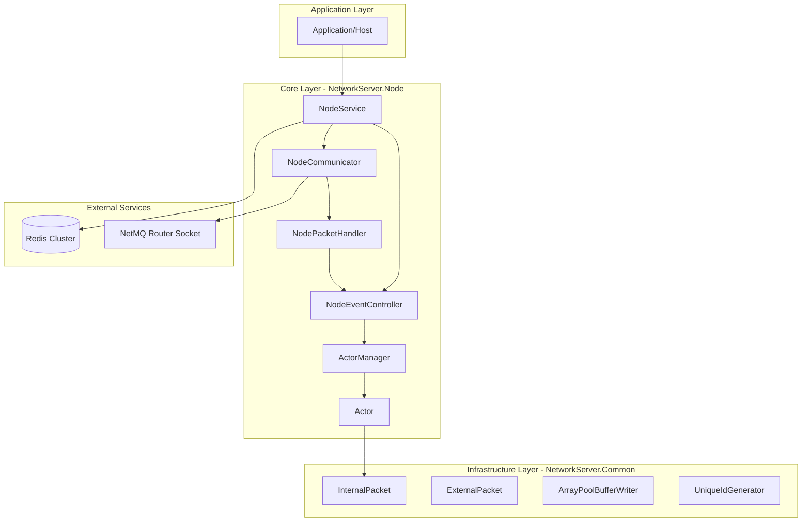

## 1. Infrastructure Layer - NetworkServer.Common

### Packet System

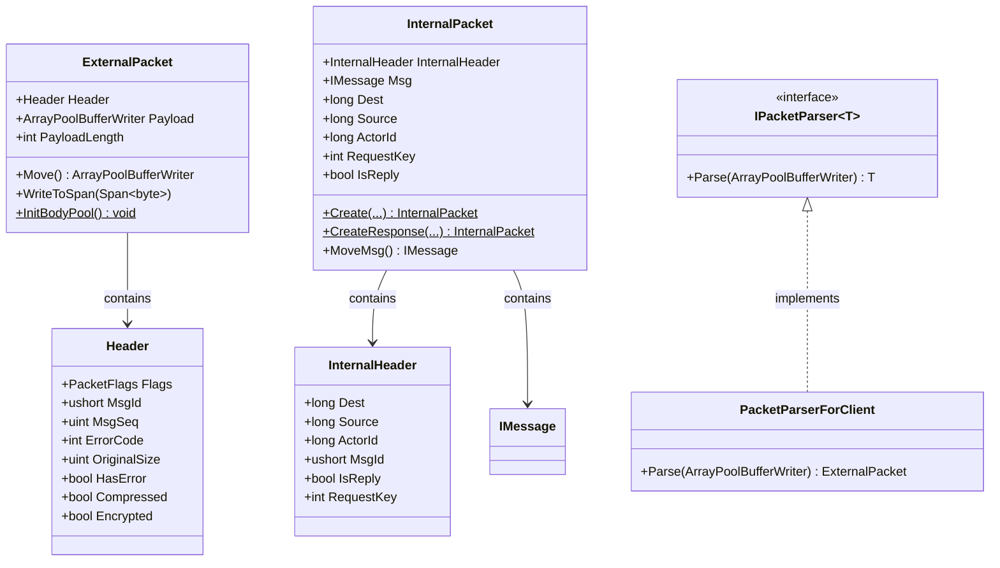

### Memory & Utilities

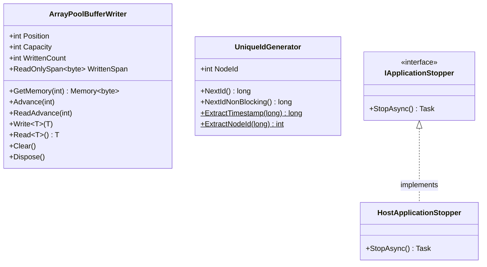

## 2. Core Layer - NetworkServer.Node

### Node Service & Configuration

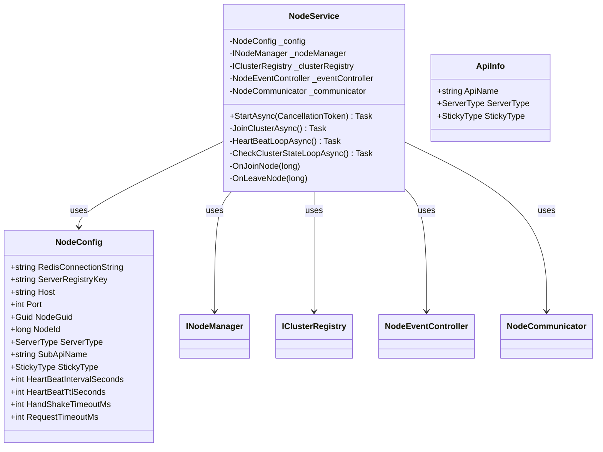

### Actor System

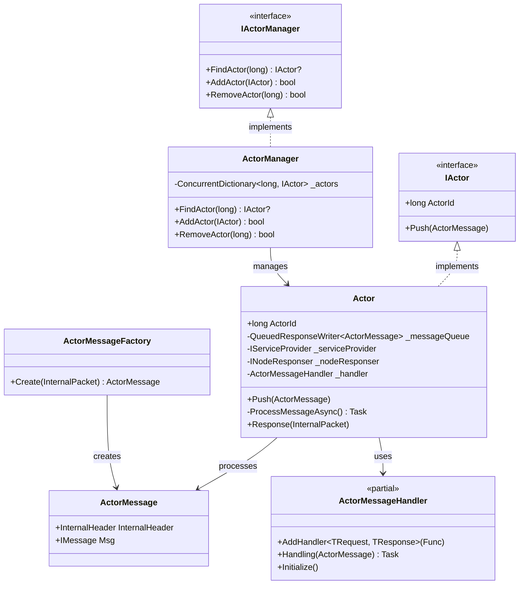

### Node Management

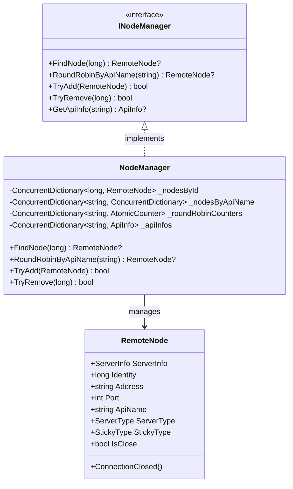

### Network Layer

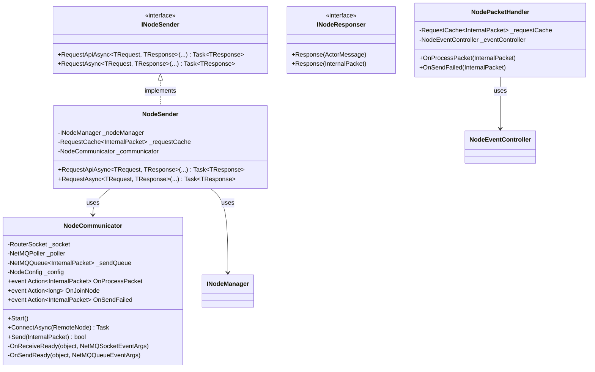

### Event System

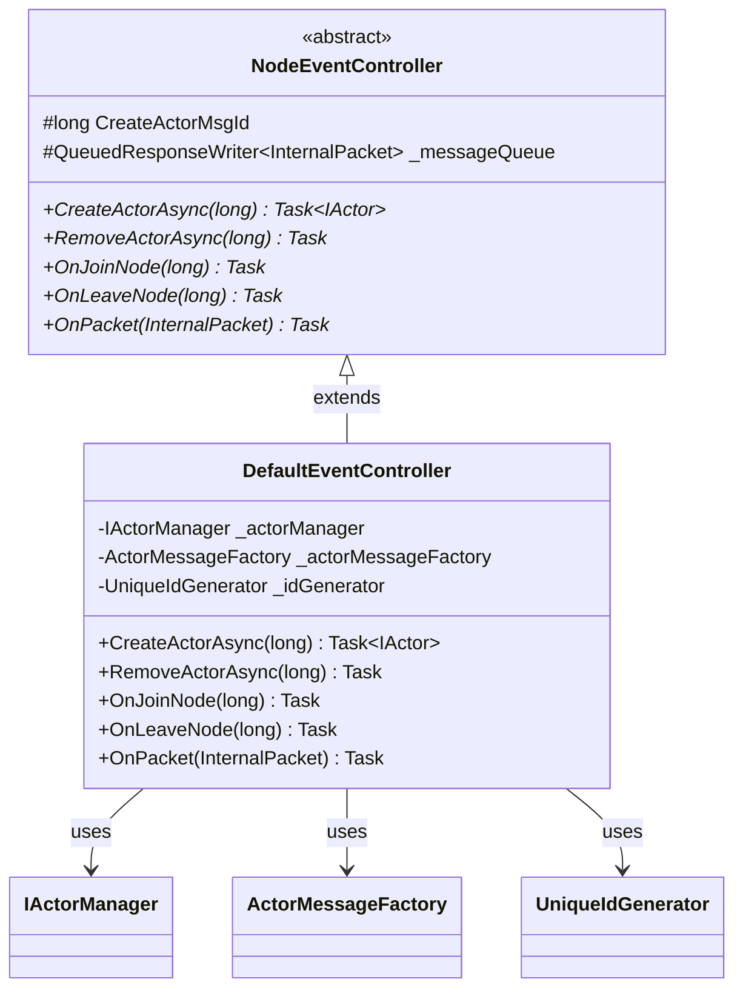

### Cluster Registry

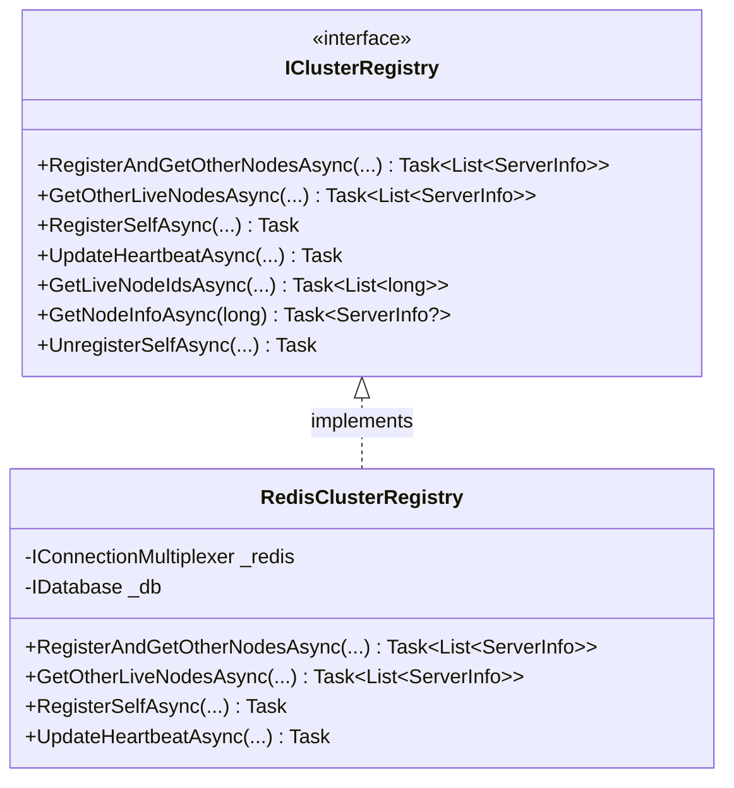

### Utilities

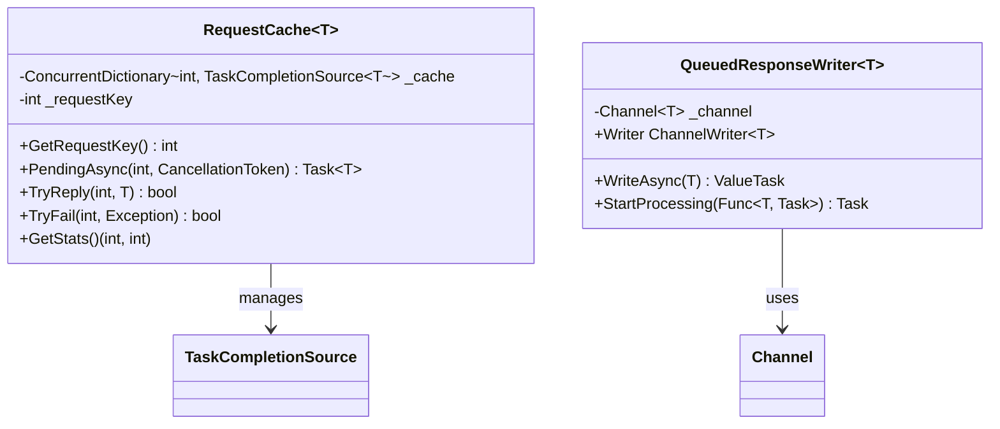

## 3. 전체 시스템 상호작용 다이어그램

```mermaid
sequenceDiagram
    participant App as Application
    participant NS as NodeService
    participant NC as NodeCommunicator
    participant NPH as NodePacketHandler
    participant NEC as NodeEventController
    participant AM as ActorManager
    participant Actor as Actor
    participant Redis as Redis Cluster

    App->>NS: StartAsync()
    NS->>Redis: RegisterAndGetOtherNodesAsync()
    Redis-->>NS: List<ServerInfo>

    loop For each remote node
        NS->>NC: ConnectAsync(RemoteNode)
        NC-->>NS: Connected
    end

    NS->>NS: HeartBeatLoopAsync()
    NS->>NS: CheckClusterStateLoopAsync()

    Note over NC: Remote Node sends packet
    NC->>NPH: OnProcessPacket(InternalPacket)

    alt Is Reply
        NPH->>RequestCache: TryReply()
    else Is New Request
        NPH->>NEC: OnPacket(InternalPacket)
        NEC->>AM: FindActor(ActorId)

        alt Actor exists
            AM-->>NEC: Actor
        else Actor not found
            NEC->>NEC: CreateActorAsync(ActorId)
            NEC->>AM: AddActor(Actor)
        end

        NEC->>Actor: Push(ActorMessage)
        Actor->>ActorMessageHandler: Handling(ActorMessage)
        ActorMessageHandler-->>Actor: Response
        Actor->>NC: Send(InternalPacket)
    end
```

## 4. 패키지 의존성 다이어그램

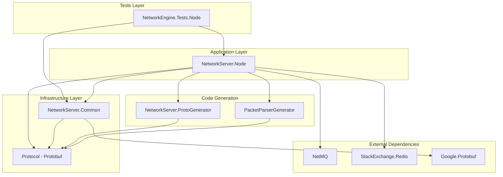

## 5. 주요 디자인 패턴

### Actor Model Pattern
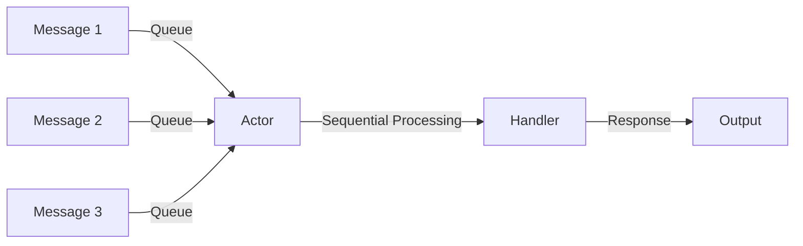

### Request/Response Pattern
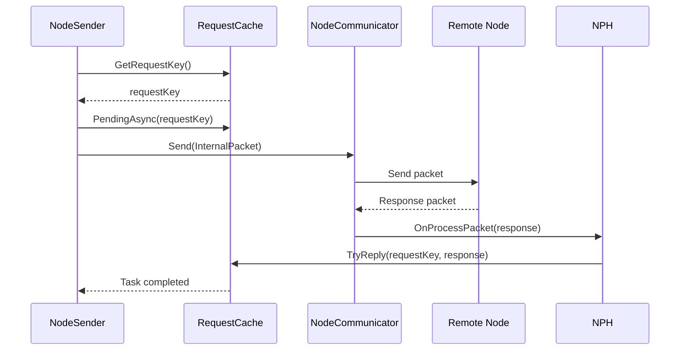

### Service Discovery Pattern
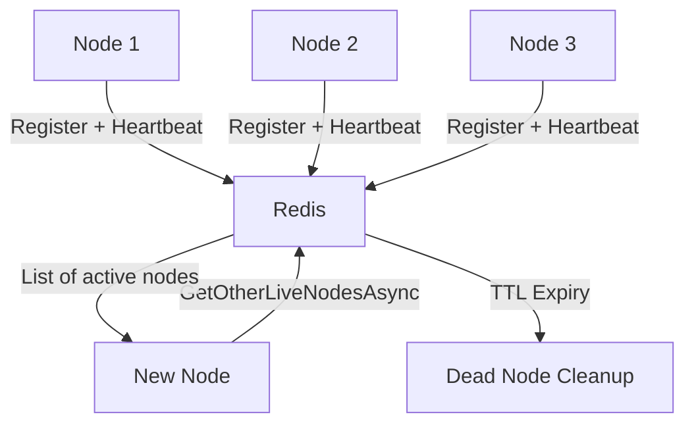

## 6. 핵심 컴포넌트별 책임

| 컴포넌트 | 책임 | 주요 기능 |
|---------|------|----------|
| **NodeService** | 노드 생명주기 관리 | 클러스터 참가, 하트비트, 노드 상태 감지 |
| **NodeCommunicator** | 네트워크 통신 | NetMQ 기반 메시지 송수신 |
| **NodeEventController** | 이벤트 처리 | 패킷 라우팅, 액터 생성 |
| **Actor** | 메시지 처리 | 순차적 메시지 처리, 상태 관리 |
| **ActorManager** | 액터 생명주기 관리 | 액터 등록/조회/제거 |
| **NodeManager** | 원격 노드 관리 | 노드 레지스트리, 로드 밸런싱 |
| **RedisClusterRegistry** | 서비스 디스커버리 | 노드 등록, 조회, TTL 관리 |
| **RequestCache** | 요청/응답 상관관계 | 타임아웃, 응답 매칭 |
| **InternalPacket** | 내부 통신 포맷 | 노드 간 메시지 전송 |
| **ExternalPacket** | 외부 통신 포맷 | 클라이언트 통신 |

## 7. 성능 최적화 기법

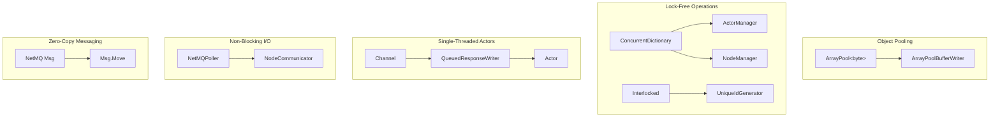

## 8. 시스템 특징 요약

### Distributed System Capabilities
- ✅ Redis 기반 서비스 디스커버리
- ✅ API별 라운드 로빈 로드 밸런싱
- ✅ 자동 장애 노드 감지 및 제거
- ✅ Zero-Copy 메시징 (NetMQ Msg 소유권 이전)
- ✅ 타임아웃 기반 비동기 요청/응답

### Performance Optimizations
- ✅ Object Pooling (ArrayPool)
- ✅ Lock-Free Operations (ConcurrentDictionary, Interlocked)
- ✅ Single-Threaded Actors (락 경합 제거)
- ✅ Non-Blocking I/O (NetMQ 이벤트 드리븐 폴러)
- ✅ 효율적인 직렬화 (Protobuf)

### Reliability Features
- ✅ Graceful Shutdown (IApplicationStopper)
- ✅ 재시도 로직 (핸드셰이크 지수 백오프)
- ✅ 타임아웃 처리 (CancellationToken)
- ✅ Self-Healing (하트비트 실패 시 자동 노드 제거)

---

**이 아키텍처는 NetMQ 기반의 분산 액터 시스템으로, Redis 서비스 디스커버리를 활용하여 마이크로서비스 환경에서 고성능 노드 간 통신을 지원합니다.**
