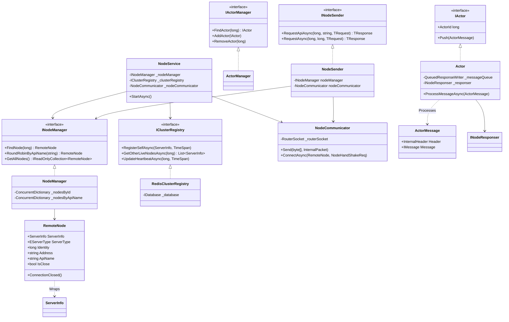

```mermaid
classDiagram
    class INodeManager {
        <<interface>>
        +FindNode(long) RemoteNode
        +RoundRobinByApiName(string) RemoteNode
        +GetAllNodes() IReadOnlyCollection~RemoteNode~
    }
    class NodeManager {
        -ConcurrentDictionary _nodesById
        -ConcurrentDictionary _nodesByApiName
    }
    INodeManager <|.. NodeManager

    class IActor {
        <<interface>>
        +ActorId long
        +Push(ActorMessage)
    }
    class Actor {
        -QueuedResponseWriter _messageQueue
        -INodeResponser _responser
        +ProcessMessageAsync(ActorMessage)
    }
    IActor <|.. Actor

    class IActorManager {
        <<interface>>
        +FindActor(long) IActor
        +AddActor(IActor)
        +RemoveActor(long)
    }
    class ActorManager {
    }
    IActorManager <|.. ActorManager

    class IClusterRegistry {
        <<interface>>
        +RegisterSelfAsync(ServerInfo, TimeSpan)
        +GetOtherLiveNodesAsync(long) List~ServerInfo~
        +UpdateHeartbeatAsync(long, TimeSpan)
    }
    class RedisClusterRegistry {
        -IDatabase _database
    }
    IClusterRegistry <|.. RedisClusterRegistry

    class INodeSender {
        <<interface>>
        +RequestApiAsync(long, string, TRequest) TResponse
        +RequestAsync(long, long, TRequest) TResponse
    }
    class NodeSender {
        -INodeManager nodeManager
        -NodeCommunicator nodeCommunicator
    }
    INodeSender <|.. NodeSender

    class NodeService {
        -INodeManager _nodeManager
        -IClusterRegistry _clusterRegistry
        -NodeCommunicator _nodeCommunicator
        +StartAsync()
    }

    class NodeCommunicator {
        -RouterSocket _routerSocket
        +Send(byte[], InternalPacket)
        +ConnectAsync(RemoteNode, NodeHandShakeReq)
    }

    class RemoteNode {
        +ServerInfo ServerInfo
        +EServerType ServerType
        +long Identity
        +string Address
        +string ApiName
        +bool IsClose
        +ConnectionClosed()
    }

    class ActorMessage {
        +InternalHeader Header
        +IMessage Message
    }

    NodeService --> INodeManager
    NodeService --> IClusterRegistry
    NodeService --> NodeCommunicator
    NodeSender --> INodeManager
    NodeSender --> NodeCommunicator
    Actor --> INodeResponser
    Actor ..> ActorMessage : Processes
    NodeManager --> RemoteNode
    RemoteNode ..> ServerInfo : Wraps
```